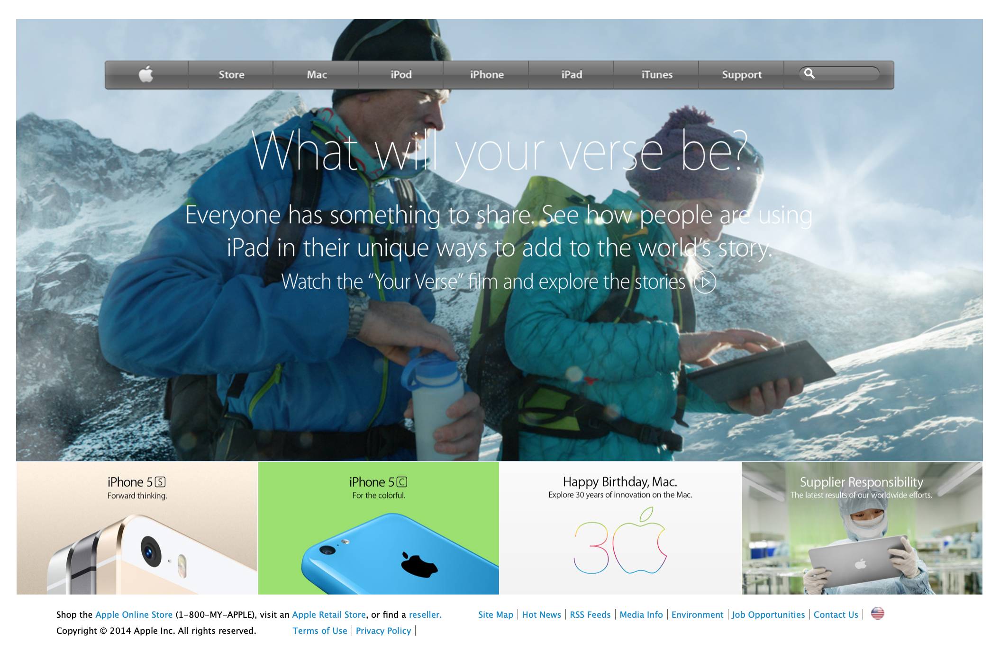

# Positioning and floating elements

> Apple clone page

Additional description about the project and its features.

## Built With

- HTML,
- CSS,
- Git

## Live Demo

[Live Demo Link](https://practical-curie-65d145.netlify.com)

## Getting Started

**Web browser needed**

To get a local copy up and running follow these simple example steps.

### Open browser

### Visit repository

### Download Repository (git@github.com:edieatha/apple.git)

### Open index.html

## Authors

👤 **Edie Atha**

- Github: [@edieatha](https://github.com/edieatha)
- Twitter: [@edieatha](https://twitter.com/edieatha)
- Linkedin: [linkedin](https://www.linkedin.com/in/edieatha/)

## 🤝 Contributing

Contributions, issues and feature requests are welcome!

Feel free to check the [issues page](https://github.com/edieatha/apple/issues).

## Show your support

Give a ⭐️ if you like this project!

## Acknowledgments

- Hat tip to anyone whose code was used
- Inspiration
- etc

## 📝 License

This project is [MIT](lic.url) licensed.
